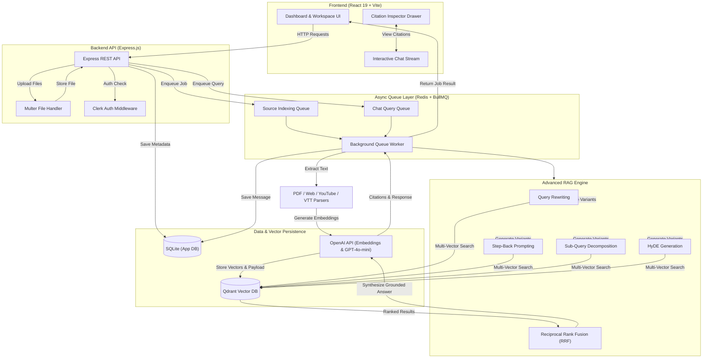

# CLASSMATE — Advanced Multi-Source RAG Workspace & NotebookLM Clone 🚀

[](https://nodejs.org/)
[](https://react.dev/)
[](https://vitejs.dev/)
[](https://tailwindcss.com/)
[](https://qdrant.tech/)
[](https://redis.io/)
[](https://openai.com/)

> A production-grade, full-stack **NotebookLM Clone** powered by an **Advanced Multi-Strategy RAG (Retrieval-Augmented Generation)** engine. It combines state-of-the-art retrieval techniques—**Query Rewriting, Step-Back Prompting, Sub-Query Decomposition, HyDE (Hypothetical Document Embeddings)**, and **Reciprocal Rank Fusion (RRF)**—with asynchronous task queue processing, strict vector workspace isolation, and an interactive **Citation Inspector UI**.

---

## 🌟 Key Features

### 📥 1. Multi-Source Knowledge Ingestion
Extract, chunk, and index content from diverse document and media formats:
- 📄 **PDF Documents**: Preserves page numbers and metadata for exact page citation.
- 🌐 **Web Articles & URLs**: Scrapes and parses main body text using `@mozilla/readability` & `JSDOM` (stripping navbars, ads, and footers).
- 🎥 **YouTube Videos**: Automatically extracts video transcripts with start and end timestamps.
- 📜 **WebVTT Transcripts**: Parses `.vtt` caption files with precise time-range mapping.
- 📝 **Plain Text & Quick Notes**: Ingest custom raw notes and snippets directly into any notebook workspace.

### 🧠 2. Advanced 5-Stage RAG Pipeline
Rather than relying on single vector lookups, CLASSMATE executes a multi-query retrieval strategy:
1. **Query Rewriting & Normalization**: Corrects spelling/grammar and expands context to make queries explicit.
2. **Step-Back Prompting**: Formulates higher-level background questions to retrieve foundational concepts.
3. **Sub-Query Decomposition**: Splits complex user questions into 3 distinct, targeted sub-queries.
4. **HyDE (Hypothetical Document Embeddings)**: Generates a synthetic ideal response passage to improve semantic vector similarity matching.
5. **Reciprocal Rank Fusion (RRF)**: Merges and re-ranks multi-vector search results from Qdrant using the RRF algorithm ($RRF\_Score = \sum \frac{1}{k + rank}$).

### 🔒 3. Strict Workspace Data Isolation
- Notebook-based organization: Users can create isolated workspaces for different research projects.
- **Qdrant Payload Filtering**: All vector search operations enforce strict `notebookId` payload metadata matching to prevent cross-notebook data leakage.

### ⚡ 4. Asynchronous Queue Architecture
- High-throughput background processing backed by **BullMQ** and **Redis**.
- Document parsing, text chunking, embedding generation, vector upsertion, and multi-step RAG retrieval run asynchronously without blocking the REST API server.
- Real-time job polling endpoints check status (`pending`, `completed`, `failed`) and return processing progress.

### 🎯 5. Grounded Responses & Interactive Citation Inspector
- AI answers feature numeric inline citation markers (e.g., `[1]`, `[2]`).
- Clicking a citation opens the **Citation Inspector Drawer**, providing:
  - Exact source snippet highlighting.
  - PDF page numbers.
  - YouTube video direct timestamp jump links (`youtube.com/watch?v=...&t=XXs`).
  - Web article source URLs.

### 🎨 6. Modern Workspace UI
- **React 19 + Vite** build setup for ultra-fast startup and hot reloading.
- Modern visual design with **Tailwind CSS v4**, **Framer Motion** animations, and **Lucide Icons**.
- **Clerk Authentication Integration** for secure user login and protected API routes (optional).

---

## 🏗️ System Architecture



---

## 🛠️ Tech Stack

| Domain | Technologies |
| :--- | :--- |
| **Frontend** | React 19, Vite, Tailwind CSS v4, Framer Motion, Lucide React, TanStack React Query, Axios, `@clerk/clerk-react` |
| **Backend API** | Node.js (ES Modules), Express.js, `@clerk/express`, Multer |
| **RAG & AI** | OpenAI API (`text-embedding-3-small`, `gpt-4o-mini`), Custom Query Rewriter, HyDE Engine, Reciprocal Rank Fusion |
| **Vector Store** | Qdrant (`@qdrant/js-client-rest`) with payload metadata filters |
| **Queues & Storage** | BullMQ, Redis (`ioredis`), SQLite (`sqlite3`) |
| **Extractors** | PDF-Parse, `@mozilla/readability`, JSDOM, `youtube-transcript`, WebVTT Parser |
| **DevOps** | Docker, Docker Compose, Postman API Collection |

---

## 📁 Repository Structure

```
advance-rag-pipeline-main/
├── backend/
│   ├── src/
│   │   ├── db/                 # SQLite database storage & schema initialization
│   │   ├── extractors/         # PDF, Web Article, YouTube & VTT Transcript extractors
│   │   │   ├── pdfExtractor.js
│   │   │   ├── vttExtractor.js
│   │   │   ├── webExtractor.js
│   │   │   └── youtubeExtractor.js
│   │   ├── config.js           # Central configuration & environment variable validation
│   │   ├── index.js            # Express API server & routes
│   │   ├── indexer.js          # Multi-source document chunking & vector ingestion
│   │   ├── openai.js           # OpenAI client & embedding generation helpers
│   │   ├── qdrant.js           # Qdrant client connection & collection management
│   │   ├── queue.js            # BullMQ Redis task queues
│   │   ├── retriever.js        # 5-Stage Advanced RAG engine & citation builder
│   │   └── worker.js           # Background queue worker process
│   ├── data/                   # SQLite database storage directory (app.db)
│   ├── uploads/                # Local storage for uploaded PDF & transcript files
│   ├── docker-compose.yml      # Infrastructure setup (Redis & Qdrant containers)
│   ├── Advance_RAG_Pipeline.postman_collection.json # Ready-to-use Postman collection
│   ├── .env.example            # Environment template
│   └── package.json
│
└── frontend/
    ├── src/
    │   ├── api/                # Axios API client & job status polling utility
    │   ├── components/         # Modular UI Components
    │   │   ├── chat/           # Chat Stream, Message Item & Prompt Bar
    │   │   ├── citations/      # Citation Inspector Drawer
    │   │   ├── landing/        # Hero Section & Features
    │   │   ├── modals/         # Add Source Modal & Upload Handlers
    │   │   ├── notes/          # Studio Notes & Artifacts
    │   │   ├── sidebar/        # Navigation & Notebook List
    │   │   └── sources/        # Source Cards & Knowledge Base Grid
    │   ├── context/            # React Context for active notebook state
    │   ├── pages/              # Landing Page & Notebook Dashboard
    │   ├── App.jsx             # Main Application Routing & Layout
    │   ├── main.jsx            # React Root Entry Point
    │   └── index.css           # Tailwind CSS v4 & custom scrollbar styles
    ├── package.json
    └── vite.config.js          # Vite config with API backend proxy
```

---

## ⚡ Getting Started

### 1. Prerequisites
Ensure you have the following installed on your system:
- **Node.js**: `v18.0.0` or higher
- **npm**: `v9.0.0` or higher
- **Docker Desktop**: Required to run Qdrant Vector Database & Redis

---

### 2. Infrastructure Setup (Redis & Qdrant)

Navigate to the `backend` directory and start the Docker services:

```bash
cd backend

# Start Qdrant (Port 6333) and Redis (Port 6379) in detached mode
npm run services:up
```

---

### 3. Environment Configuration

Create a `.env` file in the `backend` directory by copying `.env.example`:

```bash
cp .env.example .env
```

Configure your environment variables in `backend/.env`:

```env
# Express Server Port
PORT=8000

# Redis Connection (BullMQ)
REDIS_HOST=127.0.0.1
REDIS_PORT=6379
REDIS_PASSWORD=
REDIS_TLS=false

# Qdrant Vector Database
QDRANT_URL=http://127.0.0.1:6333
QDRANT_API_KEY=
QDRANT_COLLECTION=documents

# OpenAI API Key (Required for Embeddings & Chat)
OPENAI_API_KEY=sk-proj-your-openai-api-key

# Optional Clerk Authentication
CLERK_PUBLISHABLE_KEY=pk_test_...
CLERK_SECRET_KEY=sk_test_...

# AI Models & Chunking Parameters
EMBEDDING_MODEL=text-embedding-3-small
EMBEDDING_DIMENSIONS=1536
CHAT_MODEL=gpt-4o-mini
CHUNK_SIZE=1000
CHUNK_OVERLAP=200

# Retrieval Parameters
RETRIEVAL_TOP_K=4
RRF_K=60
RETRIEVAL_FINAL_K=5
```

---

### 4. Install Dependencies & Start Backend Services

In the `backend` directory, install packages and start both the **API Server** and **Background Queue Worker**:

```bash
# Install backend dependencies
npm install

# Start Express REST API Server (Terminal 1)
npm run start

# Start BullMQ Background Worker (Terminal 2)
npm run worker
```

---

### 5. Start Frontend Application

Open a new terminal window, navigate to the `frontend` directory, install dependencies, and launch the dev server:

```bash
cd frontend

# Install frontend dependencies
npm install

# Start Vite React Dev Server
npm run dev
```

Open your browser and navigate to **`http://localhost:5173`**.

---

## 🔍 Advanced RAG Workflow Explained

```
                     +-----------------------+
                     |  User Question Input  |
                     +-----------+-----------+
                                 |
         +-----------------------+-----------------------+
         |                       |                       |
         v                       v                       v
+------------------+   +-------------------+   +------------------+
| Query Rewriting  |   | Step-Back Prompt  |   | Sub-Queries (x3) |
| (Typo/Fixes)     |   | (Broad Concept)   |   | (Decomposed)     |
+--------+---------+   +---------+---------+   +--------+---------+
         |                       |                      |
         +-----------------------+----------------------+
                                 |
                                 v
                     +-----------------------+
                     |    HyDE Generation    |
                     |  (Synthetic Passage)  |
                     +-----------+-----------+
                                 |
                                 v
                     +-----------------------+
                     | Multi-Vector Qdrant   |
                     | Payload Filter Search |
                     +-----------+-----------+
                                 |
                                 v
                     +-----------------------+
                     | Reciprocal Rank       |
                     | Fusion (RRF Re-rank)  |
                     +-----------+-----------+
                                 |
                                 v
                     +-----------------------+
                     |  Grounded LLM Answer  |
                     |  + Citation Drawer    |
                     +-----------------------+
```

---

## 📡 REST API Reference

| Endpoint | Method | Description |
| :--- | :--- | :--- |
| `/health` | `GET` | Health check endpoint |
| `/notebooks` | `GET` | List all notebooks |
| `/notebooks` | `POST` | Create a new notebook workspace |
| `/notebooks/:id` | `GET` | Get details of a single notebook |
| `/notebooks/:id` | `DELETE` | Delete a notebook and purge its Qdrant vectors |
| `/notebooks/:id/sources` | `GET` | List all sources attached to a notebook |
| `/sources/upload` | `POST` | Upload and queue indexing for PDF / VTT files |
| `/sources/url` | `POST` | Scrape and queue indexing for a Web URL |
| `/sources/youtube` | `POST` | Fetch transcript and queue indexing for a YouTube Video |
| `/sources/text` | `POST` | Ingest plain text note into notebook |
| `/sources/:id` | `DELETE` | Delete a source and purge its vectors |
| `/chat` | `POST` | Submit a RAG query (returns a `jobId`) |
| `/jobs/:jobId` | `GET` | Poll job queue status & retrieve final answer with citations |
| `/notebooks/:id/messages` | `GET` | Get conversation history for a notebook |

---

## 📮 Postman Collection

A pre-configured Postman collection is included in the backend directory:
`backend/Advance_RAG_Pipeline.postman_collection.json`

Import this JSON into Postman to test notebook creation, multi-source uploads, asynchronous job polling, and RAG chat endpoints directly.

---

## 🤝 Contributing

Contributions are welcome! If you'd like to improve the retrieval algorithms, add new document parsers, or enhance the dashboard UI:
1. Fork the Repository
2. Create a Feature Branch (`git checkout -b feature/AmazingFeature`)
3. Commit your Changes (`git commit -m 'Add some AmazingFeature'`)
4. Push to the Branch (`git push origin feature/AmazingFeature`)
5. Open a Pull Request

---

## 📜 License

Distributed under the **ISC License**. See `LICENSE` for details.
